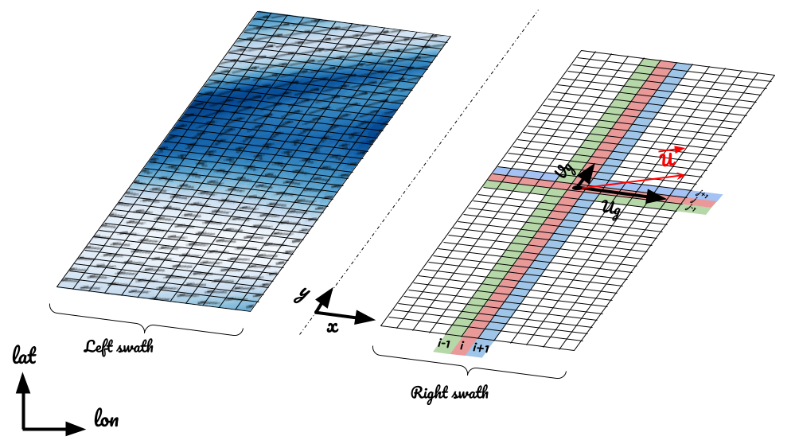

# SWOT L3p products

### Context

The upcoming SWOT altimetry mission will use radar interferometry to make wide-swath altimetry measurements of land surface water and ocean surface topography (REF Morrow et al). SWOT will therefore provide surface observations on a 2D grid (see figure above).

Complementary quantities or variables can be derived from these surface height grided observations. This repository aims to document the tools for processing SWOT level 3 products, with a particular interest in level 3+ Sea Surface Height products such as : 
 
- Geostrophic currents
- Kinetic Energy
- Vorticity of velocity field
- Divergency of velocity field
- Shearing, stretching, & total deformation of velocity field

These products are mainly based on the computation of the first and second derivative of the SSH. It is hence crucial to pay attention on the approximation of these derivative 

### Geostrophic currents 

Geostrophic currents are derived from the approximation of the Navier-Stockes equation applied to geophysical fluids assuming that the equation of motion results only from the equilibrium of the Coriolis force and the horizontal pressure gradient (Steady state, thin layer ocean, wind forcing neglected,...). Closer to the equatorial region, where the Coriolis force becomes weak, the geostrophic ....   

**_Formulation:_** 

Following the [Lagerloef et al. (1999)](https://agupubs.onlinelibrary.wiley.com/doi/epdf/10.1029/1999JC900197) approach, the geostrophic currents calculation is:
$$
u_g(x,y) = - (1 - w_b(x,y)) \frac{g}{f(x,y)}\frac{\partial h(x,y)}{\partial y} -  w_b(x,y) \frac{g}{\beta}\frac{\partial^2 h}{\partial y^2}
$$
$$
v_g(x,y) = (1 - w_b(x,y)) \frac{g}{f(x,y)}\frac{\partial h(x,y)}{\partial x} + w_b(x,y) \frac{g}{\beta}\frac{\partial^2 h}{\partial{y} \partial{x}}
$$
$$
\vec{U_g} = u_g.\vec{x} + v_g.\vec{y} 
$$

with: 
$$ w_b(x,y) = e^{-(\frac{latitude(x,y)}{2.2^{\circ}} )^2}, \textrm{the equatorial weight function} $$ 
$$ f(x,y) = 2 \Omega sin(latitude(x,y)) , \textrm{the Coriolis frequency} $$ 

### Approximation of the derivative

As mentioned by Arbic: In the vast majority of oceanographic applications, geostrophic velocities are estimated from a “three-point stencil centered difference”, in which sea surface height values at adjacent grid points are differenced to determine velocities at a central grid point.
The study of Abic et aL () suggest that wide stencil results are more reliable

*Note*:

For a 3-points stencil width, the first and second derivatives discretisation schemes are:

$$
\frac{\partial h(x,y)}{\partial y} = \frac{ h(i, j+1) - h(i, j-1) } {2 dy}
$$
$$
\frac{\partial h(x,y)}{\partial x} = \frac{ h(i+1, j) - h(i-1, j) } {2 dx}
$$

“stencil width” we mean the number of grid points utilized to estimate the finite difference approximation to the derivative on a grid

varying the accuracy of the derivative estimate

